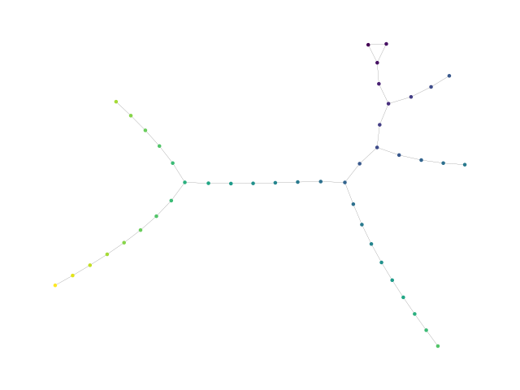
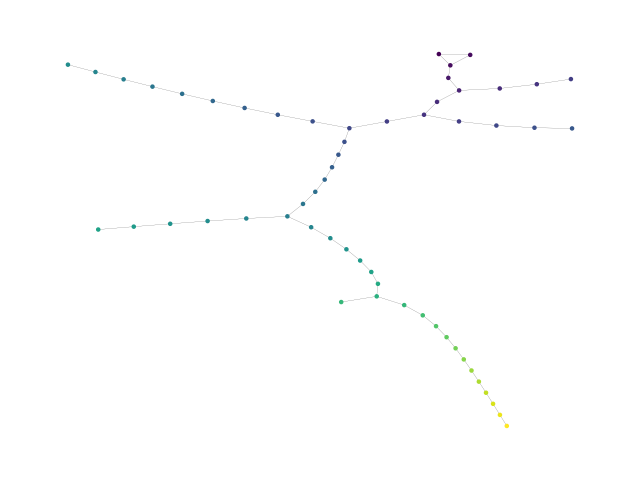
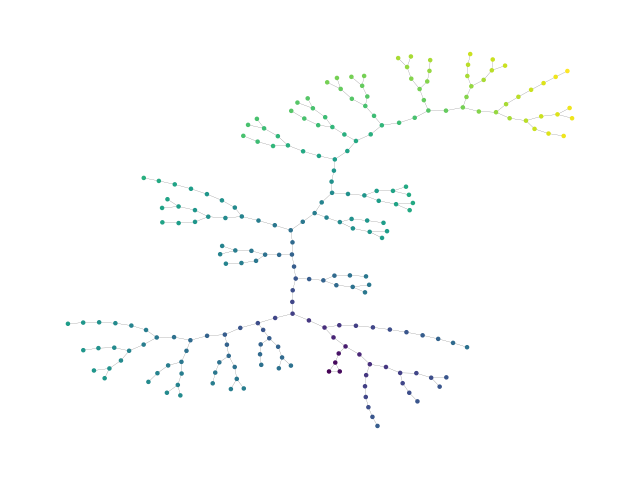

# The Collatz Conjecture
The [Collatz conjecture](https://en.wikipedia.org/wiki/Collatz_conjecture) is an unsolved problem in mathematics that states that a sequence of numbers constructed of two simple rules will eventually end up at the number 1. It is unlikely that you'll find an exception (people have tried) but it is still a lot of fun to try.


### How to use this code
Run the attached code as follows:
```bash
ipython -i collatz.py
```

This will plot the numbers 1 through 26 in a Collatz tree.



Now you can add numbers to the tree like so:
```python
add_to_tree(39) # To add the number 39
draw_tree()
```
Which will give you an updated tree:



You can also just "fill" the tree by adding new branches automatically
```python
fill_tree(5) # To add 5 more levels of numbers
draw_tree()
```



Go make some trees and have fun!