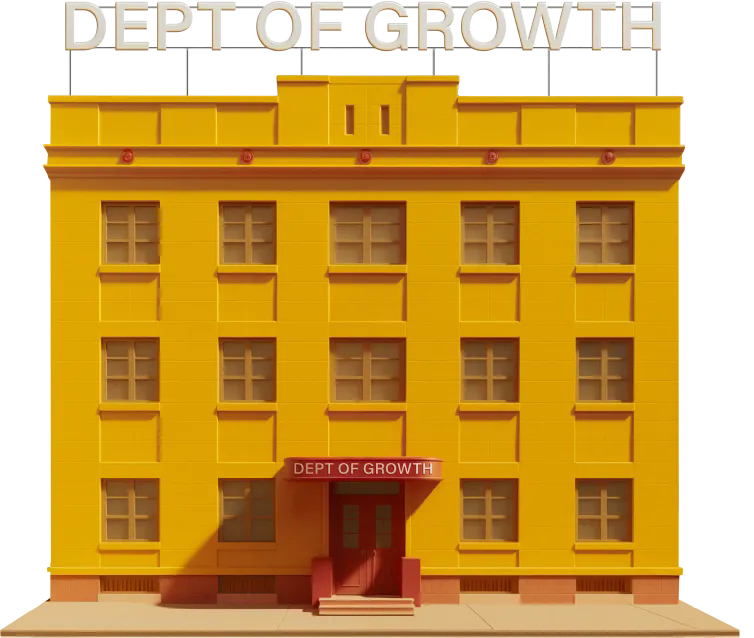

# Welcome to The Pattern Room

A collection of scripts that explore the boundary between mathematics, data science, and art - from fractals and cellular automata to emergent visual systems.

If there’s one thing we appreciate at the Department, it’s the beauty in numbers. Here we translate mathematical structures into form, uncovering how logic and randomness combine to produce patterns that feel almost alive.

## What You’ll Find

Each script in this repository is a small study in generative design and computational aesthetics:
- Fractals: Mandelbrot, Julia, and other recursive worlds
- Sequences: Collatz, Fibonacci, and number-driven visualizations
- Automata: Conway’s Game of Life, diffusion models, rule-based growth
- Chaos & Order: simulations that reveal emergent structure from simple rules

## Why It Exists

At the Department of Growth, we believe creativity doesn’t belong only to artists — it also lives in the equations, datasets, and algorithms that shape how we see the world. The Pattern Room is our playground for exploring that intersection.

## How to Use

Each project lives in its own directory with a short README and a main script.
Clone the repository and experiment freely: tweak parameters, colors, and rules - see what emerges.

```bash
git clone https://github.com/deptofgrowth/the-pattern-room.git
cd the-pattern-room/Mandelbrot
python -i  mandelbrot.py
```
## License
MIT - use freely, remix boldly, and if you build something beautiful, show us!
 
&nbsp;
 

